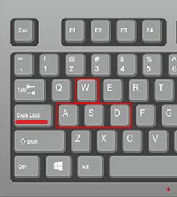
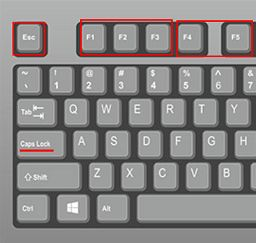
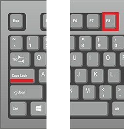
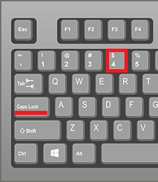
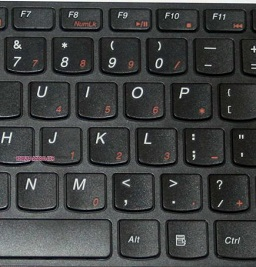
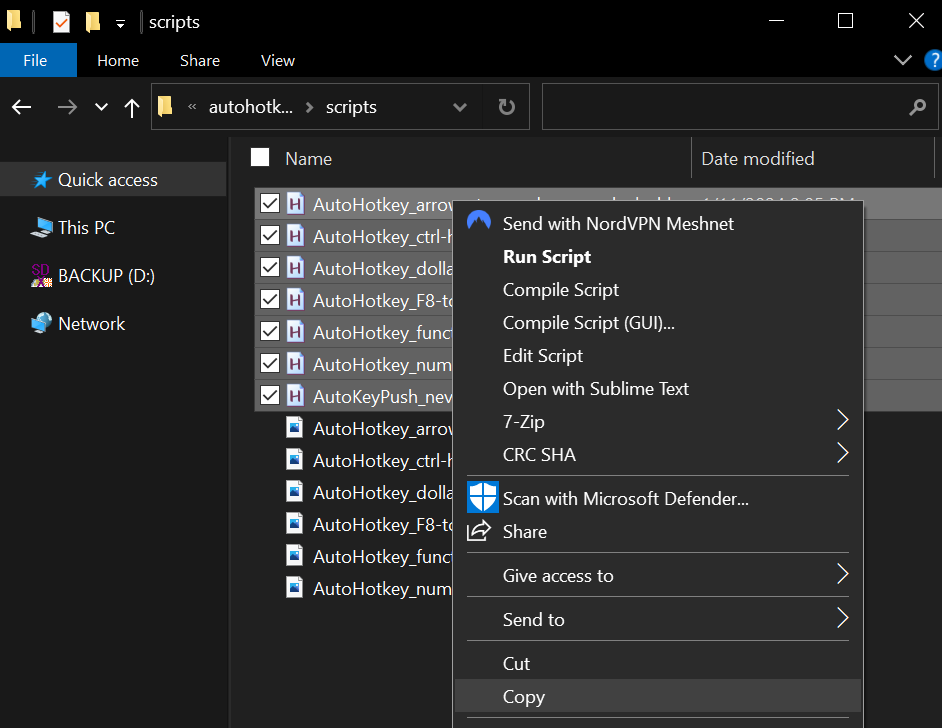

# autohotkey-scripts

My personnals AHK scripts for everyday use. Topics: 
 [automation](https://github.com/topics/automation) 
 [scripting](https://github.com/topics/scripting) 
 [hotkeys](https://github.com/topics/hotkeys) 
 [autohotkey](https://github.com/topics/autohotkey) 


----

## Requirement

Install AHK/AutoHotKey for Windows.

## Usage

Press <kbd>Caps/MAJ</kbd> to activate these scripts.

### AutoHotkey_arrows-to-wasd-on-capslock



### AutoHotkey_ctrl-h-show-hidden-files


### AutoHotkey_functionkeys-to-mouseclick



### AutoHotkey_F8-to-printscreen-on-capslock



### AutoHotkey_dollar-to-euro



### AutoHotkey_numpad-to-keypad-on-capslock




## How do I put my hotkeys and hotstrings into effect automatically every time I start my PC?

There are several ways to make a script (or any program) launch automatically every time you start your PC. The easiest is to place a shortcut to the script in the Startup folder:

1. Find the script file, select it, and press <kbd>Ctrl</kbd>+<kbd>C</kbd>.
2. Press <kbd>Win</kbd>+<kbd>R</kbd> to open the Run dialog, then enter `shell:startup` and click OK or <kbd>Enter</kbd>. This will open the Startup folder for the current user. To instead open the folder for all users, enter `shell:common startup` (however, in that case you must be an administrator to proceed).
3. Right click inside the window, and click "Paste Shortcut". The shortcut to the script should now be in the Startup folder.





---

## Release

```python
py .\tools\release.py
```

## Links

- [autohotkey.com](https://autohotkey.com)
  - [How do I put my hotkeys and hotstrings into effect automatically every time I start my PC?](https://www.autohotkey.com/docs/v1/FAQ.htm#Startup)
- GitHub
  - [ AutoHotkey](https://github.com/AutoHotkey/AutoHotkey)